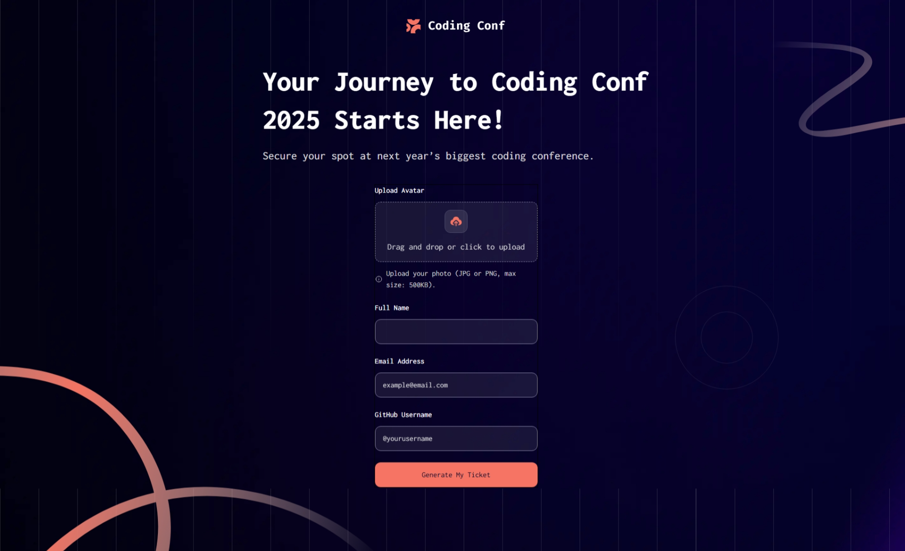

# Conference Ticket Generator

This project is a solution to the **Conference Ticket Generator Challenge**.  
Built with **Next.js** and **Tailwind CSS**, the goal was to replicate the given design as closely as possible while implementing form validation, accessibility features, and dynamic ticket generation.

## ✨ Features

- Complete the form with personal details
- Form validation:
  - Required fields must be filled
  - Proper email format validation
  - Avatar upload must meet size and format restrictions
- Full keyboard navigation support
- Screen reader accessibility:
  - Inputs, field hints, and error messages are announced
- Display the generated conference ticket after successful submission
- Responsive layout optimized for all screen sizes
- Hover and focus states for all interactive elements

## 🔗 Solution

[View Solution Repository](#)
## 🚀 Live Demo

[View Live Site](https://conference-ticket-generator-beta-wine.vercel.app/) 
## 📸 Preview

 
---

## 🛠️ Built With

- [Next.js](https://nextjs.org/)
- [Tailwind CSS](https://tailwindcss.com/)
- [Vercel](https://vercel.com/) (for deployment)

---

## Getting Started

To run the project locally:

```bash
# Clone the repository
git clone <repository-url>

# Navigate into the project directory
cd conference-ticket-generator

# Install dependencies
npm install

# Run the development server
npm run dev
```

Open [http://localhost:3000](http://localhost:3000) with your browser to see the result.

